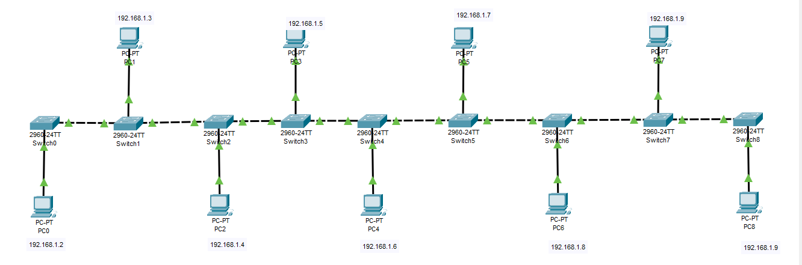
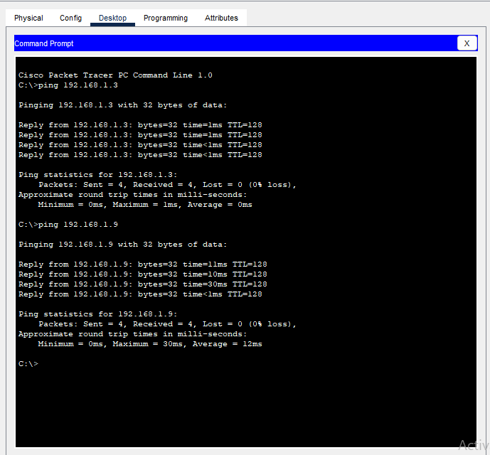

# Bus Topology

## Overview
A bus network topology where all devices are connected through switches in a linear backbone configuration.

## Characteristics
- **Layout**: Linear bus with switches connected in series, each serving one PC
- **Advantages**: Simple setup, easy to understand, cost-effective for small networks
- **Disadvantages**: Single point of failure in backbone, performance degrades with heavy traffic, entire network affected if backbone fails

## Network Configuration
- **Total Devices**: 9 PCs, 9 Switches
- **IP Scheme**: 192.168.1.0/24
- **Backbone Type**: Switches connected in linear bus
- **Cabling**: Straight-through cables from PCs to switches, crossover cables between switches

## Devices Used
- 9 PCs (PC0 through PC8)
- 9 Switches (Switch0 through Switch8)
- Straight-through UTP cables (PC to Switch)
- Crossover UTP cables (Switch to Switch)

## IP Address Table
| Device | IP Address | Subnet Mask | Default Gateway | Connected Switch |
|--------|------------|-------------|-----------------|-----------------|
| PC0 | 192.168.1.2 | 255.255.255.0 | 192.168.1.1 | Switch0 |
| PC1 | 192.168.1.3 | 255.255.255.0 | 192.168.1.1 | Switch1 |
| PC2 | 192.168.1.4 | 255.255.255.0 | 192.168.1.1 | Switch2 |
| PC3 | 192.168.1.5 | 255.255.255.0 | 192.168.1.1 | Switch3 |
| PC4 | 192.168.1.6 | 255.255.255.0 | 192.168.1.1 | Switch4 |
| PC5 | 192.168.1.7 | 255.255.255.0 | 192.168.1.1 | Switch5 |
| PC6 | 192.168.1.8 | 255.255.255.0 | 192.168.1.1 | Switch6 |
| PC7 | 192.168.1.9 | 255.255.255.0 | 192.168.1.1 | Switch7 |
| PC8 | 192.168.1.10 | 255.255.255.0 | 192.168.1.1 | Switch8 |

## Switch Connection Table
| Switch | Connected To | Cable Type |
|--------|-------------|------------|
| Switch0 | PC0, Switch1 | Straight-through, Crossover |
| Switch1 | PC1, Switch0, Switch2 | Straight-through, Crossover, Crossover |
| Switch2 | PC2, Switch1, Switch3 | Straight-through, Crossover, Crossover |
| Switch3 | PC3, Switch2, Switch4 | Straight-through, Crossover, Crossover |
| Switch4 | PC4, Switch3, Switch5 | Straight-through, Crossover, Crossover |
| Switch5 | PC5, Switch4, Switch6 | Straight-through, Crossover, Crossover |
| Switch6 | PC6, Switch5, Switch7 | Straight-through, Crossover, Crossover |
| Switch7 | PC7, Switch6, Switch8 | Straight-through, Crossover, Crossover |
| Switch8 | PC8, Switch7 | Straight-through, Crossover |

## Configuration Notes
- All devices in the same broadcast domain (192.168.1.0/24)
- Switch-to-switch connections use crossover cables
- PC-to-switch connections use straight-through cables
- Default gateway reserved as 192.168.1.1 for future router integration
- Each PC has a dedicated switch port

## Screenshots

*Complete bus topology with 9 PCs and 9 switches in linear configuration*

*PC0 IP configuration example*

*End-to-end communication test between PC0 and PC8*

## Verification Tests
- ✅ All PCs can ping every other PC in the network
- ✅ IP addresses are unique and properly assigned
- ✅ Switch-to-switch connectivity verified
- ✅ End-to-end communication confirmed (PC0 to PC8)
- ✅ No IP address conflicts detected
- ✅ All devices in same subnet can communicate directly

## Network Performance
- **Collision Domain**: Single collision domain (if using hubs) / Multiple collision domains (since using switches)
- **Broadcast Domain**: Single broadcast domain
- **Scalability**: Easy to extend by adding more switches and PCs to the ends
