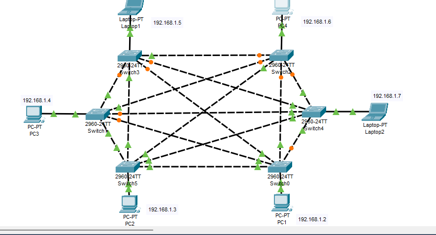
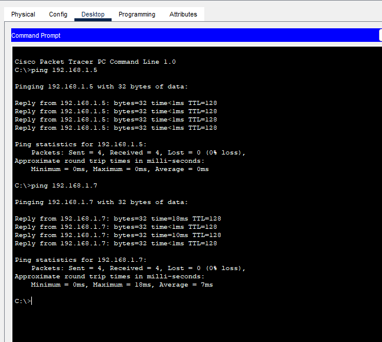

# Mesh Topology

## Overview
Full mesh topology with all switches interconnected, providing redundant paths and high reliability.

## Characteristics
- **Layout**: Full mesh - every switch connected to every other switch
- **Advantages**: Maximum redundancy, fault tolerance, high reliability, optimal performance
- **Disadvantages**: High cabling complexity, expensive to implement, difficult to manage and scale

## Network Configuration
- **Total Devices**: 4 PCs, 2 Laptops, 6 Switches
- **IP Scheme**: 192.168.1.0/24
- **Mesh Type**: Full Mesh (all switches interconnected)
- **Total Switch Connections**: 15 direct connections (n*(n-1)/2 where n=6)
- **Cabling**: Crossover cables between switches, straight-through to end devices

## Devices Used
- 4 PCs (PC1, PC2, PC3, PC4)
- 2 Laptops (Laptop1, Laptop2)
- 6 Switches (Switch0, Switch1, Switch2, Switch3, Switch4, Switch5)

## IP Address Table
| Device | IP Address | Subnet Mask | Default Gateway | Connected Switch |
|--------|------------|-------------|-----------------|-----------------|
| PC1 | 192.168.1.2 | 255.255.255.0 | 192.168.1.1 | Switch0 |
| PC2 | 192.168.1.3 | 255.255.255.0 | 192.168.1.1 | Switch1 |
| PC3 | 192.168.1.4 | 255.255.255.0 | 192.168.1.1 | Switch2 |
| Laptop1 | 192.168.1.5 | 255.255.255.0 | 192.168.1.1 | Switch3 |
| PC4 | 192.168.1.6 | 255.255.255.0 | 192.168.1.1 | Switch4 |
| Laptop2 | 192.168.1.7 | 255.255.255.0 | 192.168.1.1 | Switch5 |

## Switch Mesh Connection Table
| Switch | Connected To (Switches) | Total Connections |
|--------|------------------------|-------------------|
| Switch0 | Switch1, Switch2, Switch3, Switch4, Switch5 | 5 connections |
| Switch1 | Switch0, Switch2, Switch3, Switch4, Switch5 | 5 connections |
| Switch2 | Switch0, Switch1, Switch3, Switch4, Switch5 | 5 connections |
| Switch3 | Switch0, Switch1, Switch2, Switch4, Switch5 | 5 connections |
| Switch4 | Switch0, Switch1, Switch2, Switch3, Switch5 | 5 connections |
| Switch5 | Switch0, Switch1, Switch2, Switch3, Switch4 | 5 connections |

## End Device to Switch Mapping
| End Device | Connected Switch | Port Type |
|------------|-----------------|-----------|
| PC1 | Switch0 | FastEthernet0/1 |
| PC2 | Switch1 | FastEthernet0/1 |
| PC3 | Switch2 | FastEthernet0/1 |
| Laptop1 | Switch3 | FastEthernet0/1 |
| PC4 | Switch4 | FastEthernet0/1 |
| Laptop2 | Switch5 | FastEthernet0/1 |

## Configuration Notes
- Full mesh topology with 6 switches creating 15 inter-switch links
- All devices in single broadcast domain (192.168.1.0/24)
- Switch-to-switch connections use crossover cables
- End device to switch connections use straight-through cables
- Spanning Tree Protocol (STP) should be enabled to prevent switching loops
- Default gateway reserved as 192.168.1.1

## Redundancy Analysis
- **Paths between any two devices**: Multiple paths available
- **Fault tolerance**: Network remains connected even if multiple links fail
- **Maximum link failures before disconnect**: Up to 4 links can fail while maintaining connectivity between any two devices

## Screenshots

*Full mesh topology showing all switch interconnections*

*PC1 IP configuration example*

*Connectivity test after simulating link failures*

## Verification Tests
- ✅ All end devices can ping every other end device
- ✅ Multiple paths verified between all device pairs
- ✅ Fault tolerance tested by disabling random links
- ✅ No switching loops detected (STP functioning)
- ✅ All IP addresses unique and properly configured
- ✅ End-to-end connectivity maintained during link failures

## Performance Characteristics
- **Latency**: Minimal due to direct paths
- **Reliability**: Very high - multiple redundant paths
- **Scalability**: Poor - adding switches increases connections exponentially
- **Cost**: High - requires n*(n-1)/2 connections for n switches

## Mesh Formula Verification
- Number of switches (n) = 6
- Required connections = n*(n-1)/2 = 6*5/2 = 15 ✓
- Confirmed: Full mesh implementation correct
