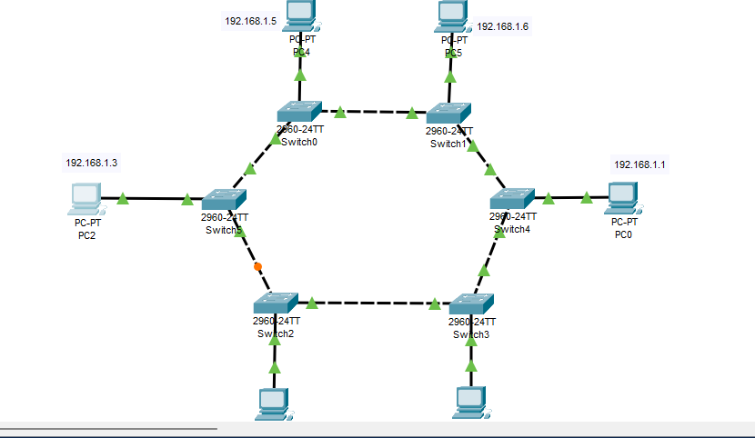
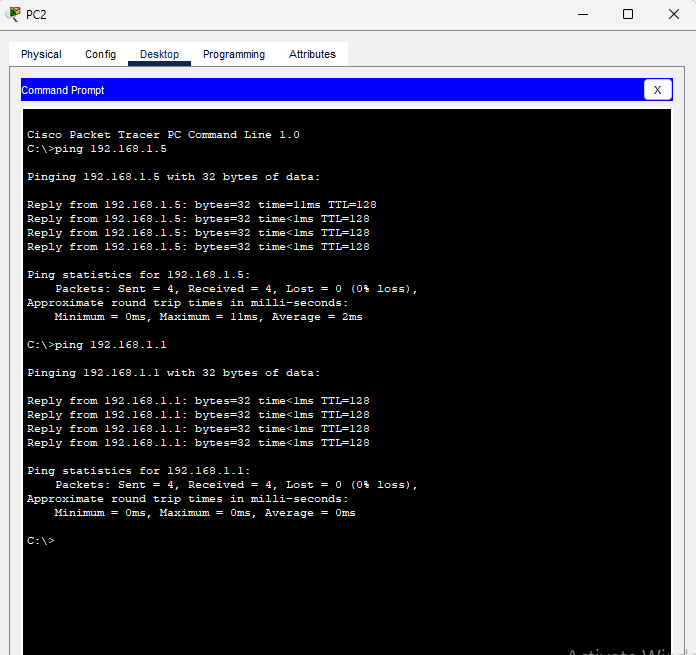

# Ring Topology

## Overview
Network topology where switches are connected in a circular ring formation, with each PC connected directly to its respective switch in sequential order.

## Characteristics
- **Layout**: Switches form a physical ring, PCs connect individually to each switch
- **Advantages**: Equal network access, orderly data transmission, better performance under load than bus
- **Disadvantages**: Single break disrupts entire network, difficult to troubleshoot, complex cabling

## Network Configuration
- **Total Devices**: 6 PCs, 6 Switches
- **IP Scheme**: 196.168.1.0/24
- **Topology Type**: Physical ring of switches with star connections to PCs
- **Data Flow**: Unidirectional around the switch ring
- **Cabling**: Switch-to-switch crossover cables in ring, straight-through cables to PCs

## Devices Used
- 6 PCs (PC0, PC3, PC1, PC2, PC4, PC5) - in connection order
- 6 Switches (Switch4, Switch3, Switch2, Switch5, Switch0, Switch1) - in ring order
- Straight-through UTP cables (PC to Switch)
- Crossover UTP cables (Switch to Switch in ring)

## IP Address Table (in connection order)
| Device | IP Address | Subnet Mask | Default Gateway | Connected Switch |
|--------|------------|-------------|-----------------|-----------------|
| PC0 | 196.168.1.1 | 255.255.255.0 | 196.168.1.254 | Switch4 |
| PC3 | 196.168.1.2 | 255.255.255.0 | 196.168.1.254 | Switch3 |
| PC1 | 196.168.1.3 | 255.255.255.0 | 196.168.1.254 | Switch2 |
| PC2 | 196.168.1.4 | 255.255.255.0 | 196.168.1.254 | Switch5 |
| PC4 | 196.168.1.5 | 255.255.255.0 | 196.168.1.254 | Switch0 |
| PC5 | 196.168.1.6 | 255.255.255.0 | 196.168.1.254 | Switch1 |

## Ring Connection Order
**Switch Ring Sequence:**

**PC to Switch Mapping:**
- Switch4 → PC0 (196.168.1.1)
- Switch3 → PC3 (196.168.1.2) 
- Switch2 → PC1 (196.168.1.3)
- Switch5 → PC2 (196.168.1.4)
- Switch0 → PC4 (196.168.1.5)
- Switch1 → PC5 (196.168.1.6)

## Complete Network Path

## Configuration Notes
- All devices in single broadcast domain (196.168.1.0/24)
- Switch ring uses crossover cables for inter-switch connections
- PC connections use straight-through cables
- IP addresses assigned sequentially in connection order around the ring
- Spanning Tree Protocol should be disabled for ring functionality
- Default gateway reserved as 196.168.1.254

## Data Flow Analysis
- **Path from PC0 to PC5**: PC0 → Switch4 → Switch3 → Switch2 → Switch5 → Switch0 → Switch1 → PC5 (6 hops)
- **Path from PC3 to PC1**: PC3 → Switch3 → Switch2 → PC1 (2 hops)
- **Maximum Hops**: 5 (between opposite sides of ring)
- **Minimum Hops**: 1 (adjacent devices on same switch)

## Screenshots

*Ring topology showing switches in circular formation with connected PCs*

*PC0 configuration with IP 196.168.1.1*

*Switch connections confirming ring formation*

*End-to-end communication test around the ring*

## Verification Tests
- ✅ All PCs can ping every other PC through the ring
- ✅ Ring integrity confirmed - circular connectivity working
- ✅ Sequential IP assignment verified around the ring
- ✅ Single point of failure test - breaking any switch link disrupts entire network
- ✅ Hop count verification - varying hops depending on position

## Performance Characteristics
- **Average Latency**: Medium (data may traverse multiple switches)
- **Reliability**: Low - dependent on ring integrity
- **Deterministic Access**: Equal transmission opportunity
- **Fault Tolerance**: None - single failure breaks entire network

## Network Resilience
- **Weakness**: Any single cable break between switches stops all communication
- **Recovery**: Manual intervention required to restore connectivity
- **Monitoring**: Difficult to isolate faults in ring structure
