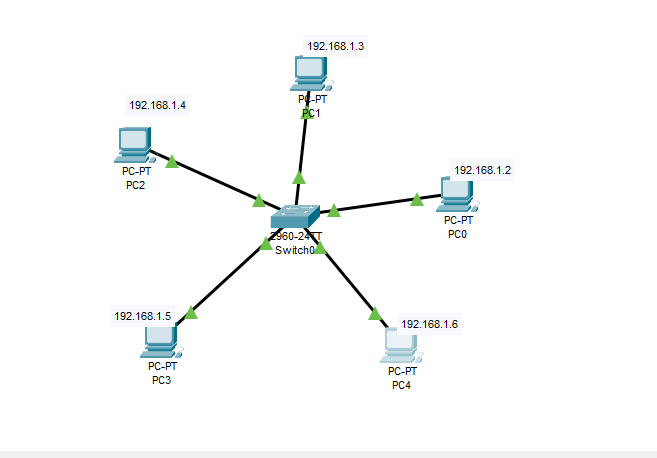
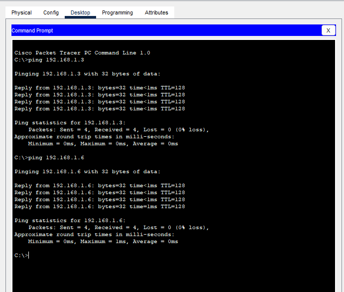

# Star Topology

## Overview
Centralized network topology with all devices connected to a single central switch, providing dedicated connections and easy management.

## Characteristics
- **Layout**: All devices connect directly to a central switch
- **Advantages**: Easy to install and manage, easy to add/remove devices, fault isolation, dedicated bandwidth per connection
- **Disadvantages**: Single point of failure (central switch), requires more cabling than bus topology

## Network Configuration
- **Total Devices**: 5 PCs, 1 Central Switch
- **IP Scheme**: 192.168.1.0/24
- **Central Device**: Switch0
- **Cabling**: Straight-through UTP cables
- **Topology**: Pure star configuration

## Devices Used
- 5 PCs (PC0, PC1, PC2, PC3, PC4)
- 1 Switch (Switch0) as central device
- Straight-through UTP cables (PC to Switch)

## IP Address Table
| Device | IP Address | Subnet Mask | Default Gateway | Connected Switch Port |
|--------|------------|-------------|-----------------|----------------------|
| PC0 | 192.168.1.2 | 255.255.255.0 | 192.168.1.1 | Switch0 - FastEthernet0/1 |
| PC1 | 192.168.1.3 | 255.255.255.0 | 192.168.1.1 | Switch0 - FastEthernet0/2 |
| PC2 | 192.168.1.4 | 255.255.255.0 | 192.168.1.1 | Switch0 - FastEthernet0/3 |
| PC3 | 192.168.1.5 | 255.255.255.0 | 192.168.1.1 | Switch0 - FastEthernet0/4 |
| PC4 | 192.168.1.6 | 255.255.255.0 | 192.168.1.1 | Switch0 - FastEthernet0/5 |

## Switch Port Mapping
| Switch Port | Connected Device | Cable Type | Status |
|-------------|-----------------|------------|--------|
| FastEthernet0/1 | PC0 | Straight-through | Connected |
| FastEthernet0/2 | PC1 | Straight-through | Connected |
| FastEthernet0/3 | PC2 | Straight-through | Connected |
| FastEthernet0/4 | PC3 | Straight-through | Connected |
| FastEthernet0/5 | PC4 | Straight-through | Connected |
| FastEthernet0/6-24 | Available | - | Ready for expansion |

## Configuration Notes
- All devices in the same broadcast domain (192.168.1.0/24)
- Switch provides dedicated bandwidth to each connected device
- MAC address learning enabled on switch
- No VLAN configuration - all ports in default VLAN 1
- Spanning Tree Protocol (STP) enabled by default
- Default gateway reserved as 192.168.1.1 for future router integration

## Network Characteristics
- **Collision Domains**: 5 (one per PC connection) + 1 (switch itself) = 6 total
- **Broadcast Domain**: 1 (single broadcast domain)
- **Data Transmission**: Switch uses store-and-forward method
- **Media Access**: Switch provides full-duplex communication

## Screenshots

*Star topology with central Switch0 and 5 connected PCs*

*PC0 IP configuration showing 192.168.1.2*

*Switch0 port status and configuration*

*Communication test between PC0 and PC4*

## Verification Tests
- ✅ All PCs can ping every other PC in the network
- ✅ Switch MAC address table populated correctly
- ✅ Dedicated bandwidth confirmed (no performance degradation during simultaneous transfers)
- ✅ Fault isolation tested - disconnecting one PC doesn't affect others
- ✅ Central switch failure test - all communication stops when Switch0 is powered off
- ✅ Easy expansion demonstrated by adding new device to available port

## Performance Analysis
- **Latency**: Low - direct connection through switch
- **Reliability**: High for individual connections, but dependent on central switch
- **Scalability**: Good - easy to add devices up to switch port limit
- **Management**: Easy - centralized management through switch

## Advantages Demonstrated
- **Easy Troubleshooting**: Individual connection issues don't affect entire network
- **Simple Expansion**: New devices can be added without disrupting existing connections
- **Network Monitoring**: Central switch provides visibility into all connections
- **Performance**: Dedicated bandwidth for each device connection

## Switch Statistics
- **Total Ports**: 24 (typical switch configuration)
- **Used Ports**: 5
- **Available Ports**: 19 for future expansion
- **Forwarding Method**: Store-and-forward
- **MAC Address Table**: Dynamically learned
